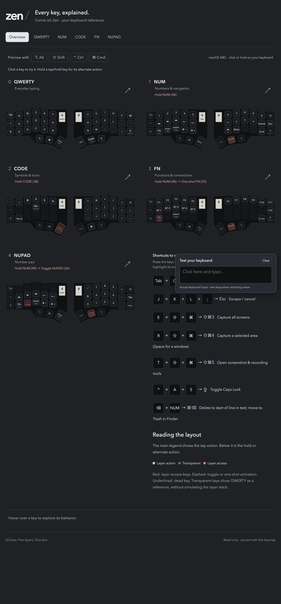

# Corne-ish Zen Custom Configuration

## Interactive layout

**[Open the interactive keyboard viewer](https://nrako.github.io/zmk-config-Corne-ish-Zen/)**

Explore all five layers, preview modifiers, and inspect key behaviors and combos.
The viewer updates automatically when keymap changes reach `main`.

The image is a snapshot; the interactive viewer reflects the current keymap.

> **Warning**
>
> If you have a Corne-ish Zen from round 3 of the group buy (delivered after October 2022) you should use the the config repo for V2 PCBs, available at [LOWPROKB/zmk-config-zen-2](https://github.com/LOWPROKB/zmk-config-zen-2) instead of this one!

This repo is the official configuration of the Corne-ish Zen low profile wireless mechanical keyboard. Use it to develop your own keymap and easily build your own ZMK firmware to run on your Corne-ish Zen. These steps will get you using your keymap on your keyboard in the fastest time possible. It uses the GitHub Actions feature to build your firmware online, rather than setting up a complex tool chain on your local computer.
If you are looking to dig deeper into ZMK and develop new functionality, it is recommended to follow the steps of installing ZMK as found on the official ZMK documentation site (linked below).

**Note:** This process is temporary, and will be used until such time that the Corne-ish Zen board definition is merged into ZMK Main.

## Resources

- The [official ZMK Firmware GitHub](https://github.com/zmkfirmware/zmk) repository. View the keymaps for other boards and shields as a starting point for your keymap.
- The [official ZMK Documentation](https://zmk.dev/docs) web site. Find the answers to many of your questions about ZMK Firmware.
- The [official ZMK Discord Server](https://discord.gg/8cfMkQksSB). Instant conversations with other ZMK developers and users. Great technical resource!

## Instructions

1. Log into, or sign up for, your personal GitHub account.
2. Fork this repository to your local computer, and then push it to your GitHub personal account. ([instructions](https://docs.github.com/en/get-started/quickstart/fork-a-repo))
3. Edit the keymap file(s) to suit your needs
4. Commit and push your changes to your personal repo. Upon pushing it, GitHub Actions will start building a new version of your firmware with the updated keymap.

## Keyboard Shortcuts & Combos

This configuration includes several combos and special behaviors to enhance productivity:

### Key Combos (simultaneous key presses)

- **Q + W** → ESC (works on QWERTY, NUM, and CODE layers)
- **Left Shift + Cmd + E** → Screenshot (full screen) - Cmd+Shift+3
- **Left Shift + Cmd + R** → Screenshot (area selection) - Cmd+Shift+4
- **Left Shift + Cmd + T** → Screenshot (window) - Cmd+Shift+5
- **A + S + D** → Caps Lock (works on QWERTY, NUM, and CODE layers)
- **P + NUM layer key** → Delete word (Cmd+Backspace)

### Special Tap/Hold/Multi-tap Behaviors

- **TAB key**: Tap = TAB, with Alt held = Alt+` (window switcher in macOS)
- **Right Shift**: Single tap = Shift, Double tap = Caps Word
- **Return key**: Normal = Return, Ctrl+Cmd+Return = Emoji Picker (sends Globe+E)
- **ESC key**: Single tap = ESC, Double tap = Dictation (sends Globe twice), Hold = Right Alt
- **Left Shift**: Normal = Shift, With Right Alt held = Globe key
  - Enables Globe combinations like Globe+H (show desktop), Globe+Space (Siri), Globe+Q (Quick Note), etc.
- **Space (on QWERTY)**: Hold = CODE layer access

### Layer Access

- **NUM layer thumb key**: Momentary access to NUM layer (hold to access, release to return)
- **' key on NUM layer**: Toggle NUPAD layer on/off
- **Z key on NUM layer**: Sticky FN layer (one-shot access)
- **C key on NUM layer**: Toggle back to QWERTY layer
- **Z key on FN layer**: Toggle FN layer on/off
- **C key on FN layer**: Toggle QWERTY layer

### macOS Integration

This keymap is optimized for macOS with special support for:
- Globe key combinations (accessed via Right Alt + Left Shift)
- Emoji picker (Ctrl+Cmd+Return)
- Dictation (double-tap ESC)
- Window management shortcuts
- Media controls on NUM layer (play/pause, volume, brightness)

## Firmware Files

To locate your firmware files...

1. log into GitHub and navigate to your personal config repository you just uploaded your keymap changes to.
2. Click "Actions" in the main navigation, and in the left navigation click the "Build" link.
3. Select the desired workflow run in the centre area of the page (based on date and time of the build you wish to use). You can also start a new build from this page by clicking the "Run workflow" button.
4. After clicking the desired workflow run, you should be presented with a section at the bottom of the page called "Artifacts". This section contains the results of your build, in a file called "firmware.zip"
5. Download the firmware zip archive and extract the two .uf2 files. They are named according to which side they need to be flashed to.
6. Flash the firmware to your keyboard by double-clicking the reset button to put the it in bootloader mode. A window should pop up showing the contents of the storage on the keyboard. Drag and drop the correct .uf2 file into the window. When the upload is complete the window will close and the keyboard will exit bootloader mode.

Your keyboard is now ready to use.
